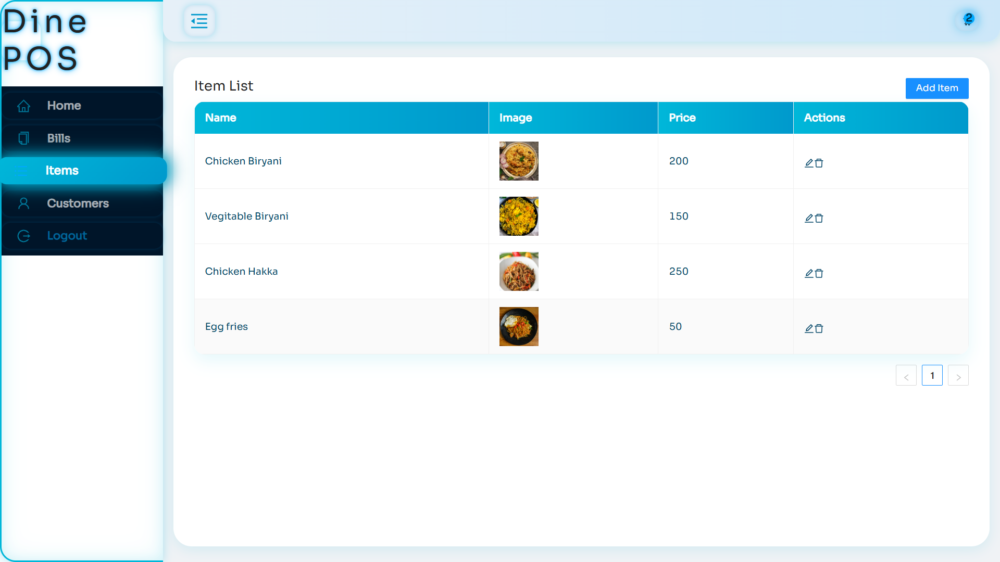

# Dine POS 

Dine POS Application is a  Mern full-stack Point of Sale system built with MongoDB, Express.js, React.js, Redux and Node.js. It supports item selection, cart management, billing, and customer tracking, providing an efficient sales management tool for small businesses.

## Table of Contents

1. [Live Website](#live-website)  
2. [Demo Video](#demo-video) 
3. [Screenshots](#screenshots)  
4. [Features](#features)  
5. [Technologies Used](#technologies-used)  
6. [Usage](#usage)  
7. [Installation](#installation)  
8. [Running the Project Locally](#running-the-project-locally)


---

## Live  Website

Check out the live demo here: [https://dine-pos.vercel.app](https://dine-pos.vercel.app)

##  Demo Video
[](./images/pos_large.gif)  
*Click on the image to view it in a larger size.*

---

## Screenshots

| Home Screen | Cart Page | Customer List |
|-------------|------------|---------------|
|  |  |  |

| Bill Generation | Item Management | Login Page |
|-----------------|-----------------|------------|
|  |  |  |


| Register | Print_preview | Printed |
|-----------------|-----------------|------------|
|  |  |  |

---

## Features

- Secure user registration and login with JWT authentication.
- Add items to cart and place orders with automatic bill generation.
- Manage and view detailed customer information.
- RESTful API backend with MongoDB for data storage.
- Intuitive React frontend with Redux for state management.
- Responsive interface designed with Ant Design components.

---


## Technologies Used

- **Frontend:** React.js, Redux, Ant Design  
- **Backend:** Node.js, Express.js  
- **Database:** MongoDB  
- **Others:** JWT for authentication, Axios for API calls

---

## Usage

1. Register a new account or login with existing credentials.  
2. Browse items, add them to the cart, and place orders.  
3. Generate bills and manage customer details easily.

---

## Installation

1. **Clone the repository**:  
   ```bash
   git clone https://github.com/AshikurRahman3/dine-pos.git
   ```

2. **Install dependencies for server and client:**  
go to root directory 

```
cd server
npm install

cd client
npm install
```
3. **Set up environment variables**  
There are separate .env files for the backend (server) and frontend (client). You can refer to the .env.example files in each folder for required variables.


**Backend (server/.env)**

- `PORT`: The port the server listens on (default is `8080`).
- `MONGO_URI`: Your MongoDB Atlas connection string or your local MongoDB URI.

```
PORT=8080
MONGO_URI=your_mongodb_connection_string
```


**frontend (client/.env)**

Create a .env file inside the client folder with variables


- `REACT_APP_API_URL`: The base URL of your backend API(default is `http://localhost:8080`).
```
REACT_APP_API_URL=http://localhost:8080

```
## Running the Project Locally

1. **Start the server**  
```
cd server
npm start
```

2. **Start the client**

```
cd client
npm start
```
3. **browse the website**

Go to [http://localhost:3000](http://localhost:3000) in your browser to use the app.


